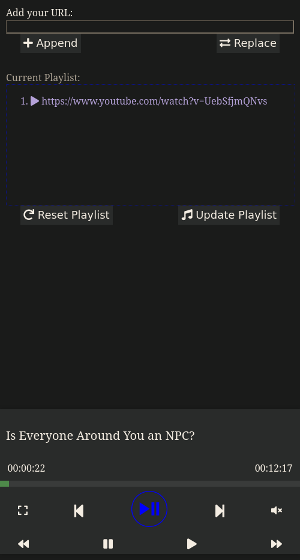

# Intro
This program uses `libmpv` to play videos/musics. It will run an idle `mpv` instance, and provide a web-app to control the mpv.

# Use Cases
A server is run in the machine with local IP address at the given port. The addresses are printed to the stdout (or use `--qr` option for a QR Code). The server will have a simple webapp to control the player. As shown in screenshot below, you can add songs based on URLs, filepaths, and control the player to a certain degree.

# Options

    Usage: local-mpv [OPTIONS] [FILES]... [-- [OPTIONS]...]
    
    Arguments:
      [FILES]...    Files to play by MPV
      [OPTIONS]...  Options for the mpv, only key-value pairs and bool flags are accepted
    
    Options:
      -l, --loop         run mpv in loop mode
      -n, --no-video     Do not show video play audio only
      -f, --fullscreen   Fullscreen
      -p, --port <PORT>  Run the server in the given port [default: 6780]
      -q, --qr           Display QR code for URL
      -h, --help         Print help (see more with '--help')
      -V, --version      Print version

# Future Plans
- Option to save/upload playlists as text file
- Option to upload a file (music/video) from client's local storage
- Play any of the entries in the playlist by clicking a button

# Installation
A small inconvience is that the `libmpv-rs` library is build against a
fixed `libmpv` version. So, clone the `libmpv-rs` repo from github,
and make sure it is made for the same version of `libmpv` that you
have in your system. You can also change the version number in the
`Cargo.toml` if the corresponding version is available in `crates.io`,
in my case, I replaced the contents in `libmpv-sys/include/` in the
`libmpv-rs` repo from the header files in `/use/include/mpv/`.

