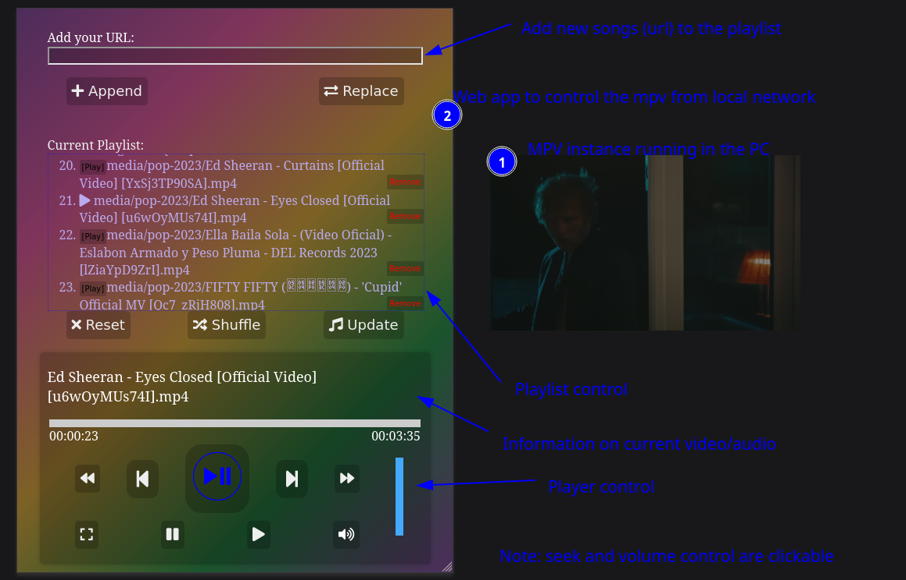

# Intro
This program uses `libmpv` to play videos/musics. It can be configured to run with a server, or wait for changes in clipboard text. In former, it'll provide a web-app to control the mpv. And in later once a new content is detected it'll pass that to the `libmpv` to play/append to playlist.

# Use Cases
## Clipboard
This can be used as a simple temporary playlist maker. You can run it in `--append` mode and just copy a bunch of youtube URLs or any other urls you have your mpv set to play. Then the `wait-mpv` will play it one after another.

You can also use this for remote music play and such using clipboard sharing programs. You can use your phone to add urls into clipboard and share that on the machine running `wait-mpv`.

## Server
When run with the server option, a server is run in the machine with local IP address at the given port. The address is printed to the stdout (or use `--qr` option for a QR Code). The server will have a simple webapp to control the player. As shown in screenshot below, you can add songs based on URLs, filepaths, and control the player to a certain degree.

# Options

Usage: wait-mpv [OPTIONS] [FILES]... [-- [OPTIONS]...]

    Arguments:
      [FILES]...    Files to play by MPV
      [OPTIONS]...  Options for the mpv, only key-value pairs and bool flags are accepted
    
    Options:
      -c, --clipboard    track clipboard contents to play media
      -l, --loop         run mpv in loop mode
      -a, --append       add things in playlist instead of playing it instantly
      -n, --no-video     Do not show video play audio only
      -f, --fullscreen   Fullscreen
      -s, --server       Run a server to control the mpv
      -p, --port <PORT>  Run the server in the given port [default: 6780]
      -q, --qr           Display QR code for URL
      -h, --help         Print help (see more with '--help')
      -V, --version      Print version

# Future Plans
- Maybe make it filter the copied contents for urls/filepaths only so that other copied text don't mess up the playlist.
- Option to save/upload playlists as text file
- Option to upload a file (music/video) from client's local storage
- Add play and delete options to the entries in the playlist

# Installation
A small inconvience is that the `libmpv-rs` library is build against a
fixed `libmpv` version. So, clone the `libmpv-rs` repo from github,
and make sure it is made for the same version of `libmpv` that you
have in your system. You can also change the version number in the
`Cargo.toml` if the corresponding version is available in `crates.io`,
in my case, I replaced the contents in `libmpv-sys/include/` in the
`libmpv-rs` repo from the header files in `/use/include/mpv/`.

